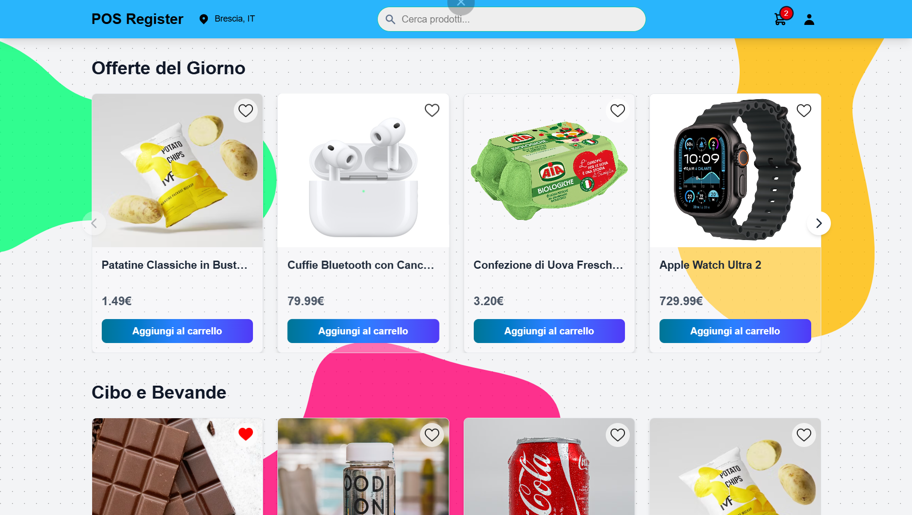
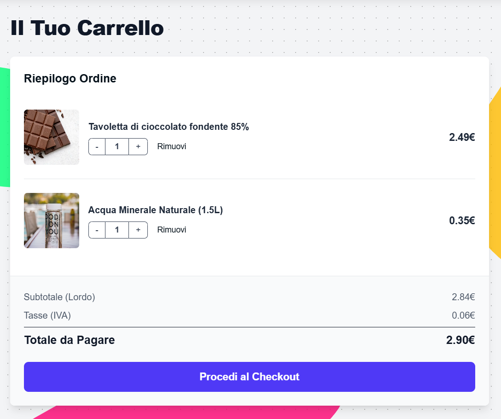

# 🛒 POS REGISTER REGESTA
<div align="center">

[](https://github.com/tuo-username/tuo-repo) 
[](https://www.python.org/) 
[](https://www.mongodb.com/) 
[](https://svelte.dev/)

</div>

> **Sistema di E-Commerce Completo con Gestione POS e Funzionalità Amministrative**

Un'applicazione web moderna per la gestione di vendite online, completa di catalogo prodotti, carrello dinamico, checkout e un pannello di controllo per l'amministratore integrato.

<div align="center">

### Homepage - Catalogo Prodotti


### Carrello e Checkout


</div>

---

## 🚀 Funzionalità Principali

-   ### 🔐 **Autenticazione e Profilo Utente**
    -   Registrazione sicura tramite **email** e **password**.
    -   Login per utenti registrati con gestione della sessione tramite **JWT**.
    -   Pagina profilo personale per aggiornare dati come **nome**, **cognome**, **telefono** e **indirizzo**.
    -   Accesso allo **storico degli ordini** con possibilità di visualizzare e stampare gli scontrini.

-   ### 🛍️ **Catalogo Prodotti e Navigazione**
    -   Homepage dinamica con prodotti organizzati per **categorie**.
    -   **Ricerca avanzata** per nome, fascia di prezzo o categoria.
    -   Pagina di **dettaglio prodotto** con descrizione completa, immagini e quantità disponibile.
    -   Sistema di **prodotti preferiti** per salvare gli articoli di interesse.

-   ### 💸 **Carrello e Processo di Acquisto**
    -   **Carrello dinamico** con aggiornamento in tempo reale di quantità e totali.
    -   Aggiunta e rimozione rapida dei prodotti.
    -   **Checkout sicuro** con riepilogo dell'ordine prima del pagamento.
    -   Calcolo automatico di **IVA** e totali.

-   ### 👑 **Pannello di Amministrazione**
    -   Accesso esclusivo per utenti con ruolo di **amministratore**.
    -   **Pannello di gestione magazzino** integrato nella pagina profilo.
    -   Monitoraggio delle **scorte critiche** (prodotti con quantità bassa o esauriti).
    -   Funzione di **Restock rapido** per aggiornare la quantità dei prodotti direttamente dall'interfaccia.
    -   Gestione completa del catalogo (aggiunta, modifica, eliminazione prodotti) tramite API protette.

---

## 🛠️ Tecnologie Utilizzate

| Categoria      | Tecnologia                               | Scopo                                                      |
| :------------- | :--------------------------------------- | :--------------------------------------------------------- |
| **Backend** | **Python (Flask)** | Creazione delle API RESTful e logica di business.          |
| **Frontend** | **Svelte** | Framework reattivo per un'interfaccia utente moderna.      |
| **Database** | **MongoDB** | Storage flessibile per prodotti, utenti e ordini.          |
| **Autenticazione** | **JWT (Flask-JWT-Extended)** | Gestione sicura delle sessioni utente tramite token.       |
| **Styling** | **Tailwind CSS** | Utility-first framework per un design rapido e personalizzato. |

---

## 🧪 Test Funzionali

Il progetto include una suite di test **End-to-End** per garantire l'affidabilità delle funzionalità critiche.

-   **Strumento**: I test sono realizzati in Python utilizzando la libreria **Selenium**.
-   **Copertura**: Vengono simulate le azioni principali dell'utente, come la registrazione, il login, l'aggiunta di prodotti al carrello e il completamento del checkout.

---

## 🚀 Guida all'Installazione e Avvio

Segui questi passaggi per configurare ed eseguire il progetto in locale.

### **1. Prerequisiti**
-   Python 3.8+
-   Node.js e npm
-   Un'istanza di MongoDB Atlas (o locale)

### **2. Setup del Backend**

1.  **Clona il repository:**
    ```bash
    git clone https://github.com/DavideBellapianta/Progetto-Regesta.git
    cd tuo-repo
    ```

2.  **Crea e attiva un ambiente virtuale:** 
    ```bash
    python -m venv venv
    source venv/bin/activate  # Su Windows: venv\Scripts\activate
    ```

3.  **Installa le dipendenze Python:**
    ```bash
    pip install -r requirements.txt
    ```

4.  **Configura le variabili d'ambiente:**
    -   Crea un file **.env** nella directory principale.
    -   Aggiungi le tue credenziali e chiavi segrete:
        ```env
        # Credenziali per MongoDB Atlas
        MONGO_USER="tuo_utente_mongo"
        MONGO_PASS="tua_password_mongo"
        
        # Secret key per la firma dei JWT (usa un valore complesso)
        JWT_SECRET_KEY="una_chiave_segreta_molto_sicura_e_lunga"
        
        # (Opzionale) Token per il servizio di geolocalizzazione IP
        IPINFO_TOKEN="tuo_token_ipinfo"
        ```

### **3. Setup del Frontend**

1.  **Naviga nella cartella del frontend:**
    ```bash
    cd frontend
    ```
2.  **Installa le dipendenze JavaScript:**
    ```bash
    npm install
    ```

### **4. Avvio dell'Applicazione**

L'applicazione richiede l'avvio separato di backend e frontend in **due terminali diversi**.

1.  **Avvia il Backend** (dalla cartella principale del progetto):
    ```bash
    python app.py  # o il nome del tuo file principale
    ```
    *Il server sarà in ascolto su `http://127.0.0.1:5000`.*

2.  **Avvia il Frontend** (dalla cartella `frontend`):
    ```bash
    npm run dev
    ```
    *L'applicazione sarà accessibile su `http://localhost:5173`.*

---

## 📄 Documentazione Completa

Per approfondimenti sul funzionamento, il design dei test e le guide all'uso, consulta i manuali dedicati:

-   **[Manuale d'Uso (Utente)](https://docs.google.com/document/d/1D-iD6ySRSMTE_2vF7IYUspjGktVcQ5FYHsPTtpqSHIg/edit?usp=sharing)**
-   **[Manuale d'Uso (Admin)](https://docs.google.com/document/d/1T4pVNrQZteYiWHWS7Yc43FHqHQ8niNeXFbfG5IZQTjk/edit?usp=sharing)**
-   **[Documentazione Test (TDD/BDD)](https://docs.google.com/document/d/1WCHKvUJXN33FFV7T_rbOO9tqv_enCzUocbcRUm5gYcU/edit?usp=sharing)**
-   **[Guida al Deploy e Clonazione](https://docs.google.com/document/d/1DaH7GuubCvphcqf7L6Eg5NuQTkLMXLHAdXNCO2p5ViY/edit?usp=sharing)**
